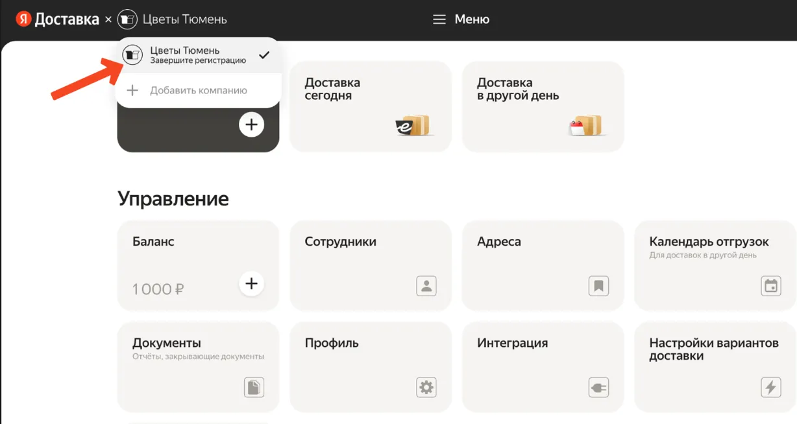
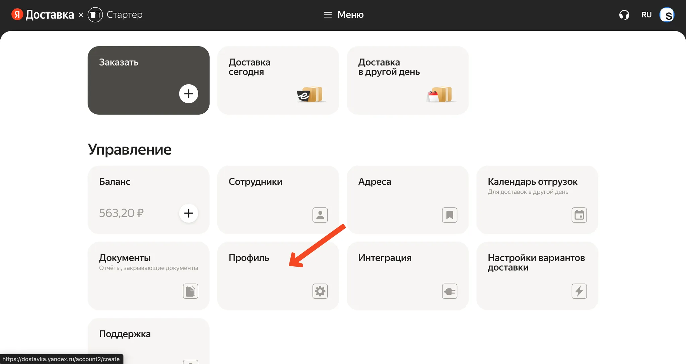
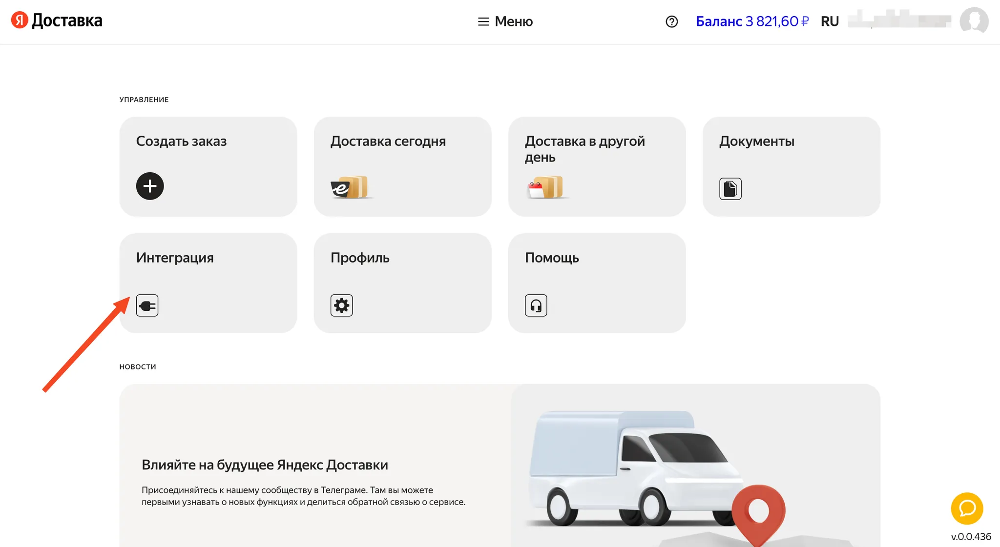
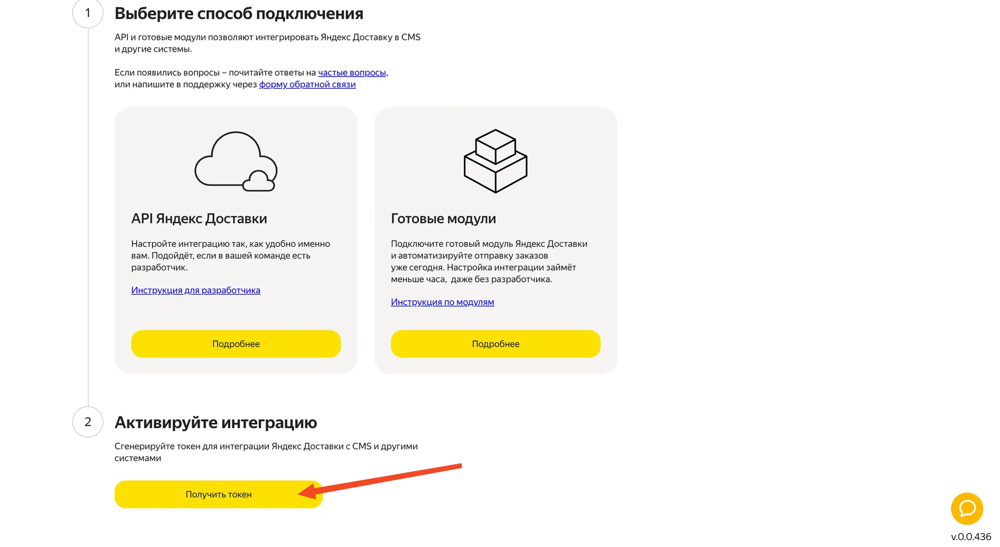
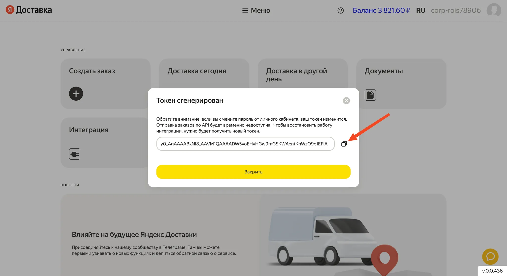

### Шаг 1: Активировать яндекс доставку

1. Убедитесь, что ваш кабинет [https://dostavka.yandex.ru/](https://dostavka.yandex.ru/) активирован и не требует регистрации. Если договор не активирован, то в ЛК будет видно, что нужно завершить регистрацию. Ниже стрелочкой показали что отображается, если регистрация не завершена.

2. Пополнить баланс от **1000 рублей**. 

	Чтобы кабинет стал активным, нужно чтобы ваш договор-оферта с Яндексом вступил в юридическую силу. Это происходит автоматически при внесении суммы в размере равном или превышающем 1000₽ с расчётного счёта организации, по платёжному поручению.
    
    После зачисления средств оферта активируется, и вы сможете пользоваться сервисом в полном объёме.
    
    Для активации договора, пополните баланс на 1000₽ с расчётного счёта компании или с карты. 
3. Перейдите в **"Профиль"**

4. Привяжите расчетный счет для списания. Внимание: если привязать банковскую карту, то активации не произойдет.
5. Оплатите счет с вашего расчетного счета от 1000 рублей и выше для активации.

---
### Шаг 2: Получить api-ключ

1. В личном кабинете яндекс доставки перейти в раздел "Интеграции".

2. Нажать на кнопку "Получить Токен"

3. Скопировать токен и отправить в чат с менеджером c подписью "токен яндекс доставки"

---
### Шаг 3: Передать информацию в чат с менеджером

1. Два номера телефона:
	- менеджера точки (если курьер не сможет найти заведение — будет номер куда позвонить, уточнить)
	- экстренный номер телефона, на случай если первый номер не отвечает
2. Комментарий для курьера текстом (обычно там пишут как быстрее найти заведение, указывают куда повернуть, на какую вывеску ориентироваться и тд). **Пример:** *Заведение Макдональдс, пройти в большие ворота во двор и повернуть налево. На здании большая вывеска “Макдональдс”*
3. Время через которое автоматически начинать поиск курьера. Настроить начало поиска курьера можно тремя способами: 
	1. Начинать поиск после окончания времени приготовления, которое задано в админке (по умолчанию стоит такая настройка) 
	2. Сразу как только пришел заказ 
	3. Спустя 5, 10, 15 (можно задать любое кол-во) минут

