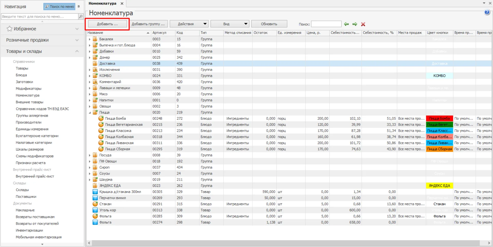
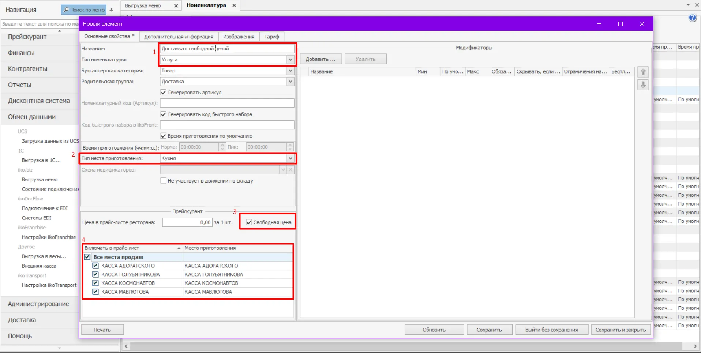

## Инструкция

1. Перейти в настройки **iikoOffice**
2. Зайти во вкладку Номенклатура и нажать Добавить…

1. Далее создаем **Услугу** (пункт “Тип номенклатуры) с названием *Доставка со свободной ценой*. Деалем настройки по примеру (не забываем поставить галочку в чекбоксе Свободная цена)

