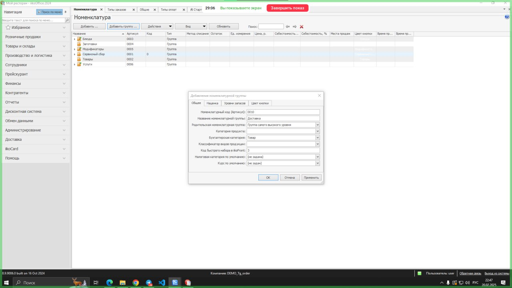

## Инструкция

1. Перейти в настройки **iikoOffice**
2. Убедиться, что есть категория доставка в списке Номенклатуры. Если ее нет, то добавляем. Для этого нажимаем **Добавить группу** и вводим данные: 
	1. Название номенклатурной группы – Доставка
	2. Родительская номенклатурная группа – Группа самого высокого уровня
	3. Жмем "Ок"

3. Зайти во вкладку Номенклатура и нажать Добавить…

4. Далее создаем **Услугу** (пункт “Тип номенклатуры) с названием *Доставка со свободной ценой*. Делаем настройки по примеру (не забываем поставить галочку в чекбоксе **Свободная цена**)

### Дальше шаги отличаются

Если вы делали выгрузку меню через **iikoWeb**, то нужно будет добавить услугу Доставка TG Order во внешнее меню именно в **iikoWeb**: [Добавление доставки через iikoWeb](./Добавление_доставки_iiko_iikoweb)

Если вы делали выгрузку меню через **iikoOffice**, то нужно будет добавить товар Доставки во меню **iikoOffice**: [Добавление доставки через iikoOffice](./Добавление_доставки_iiko_iikoOffice)