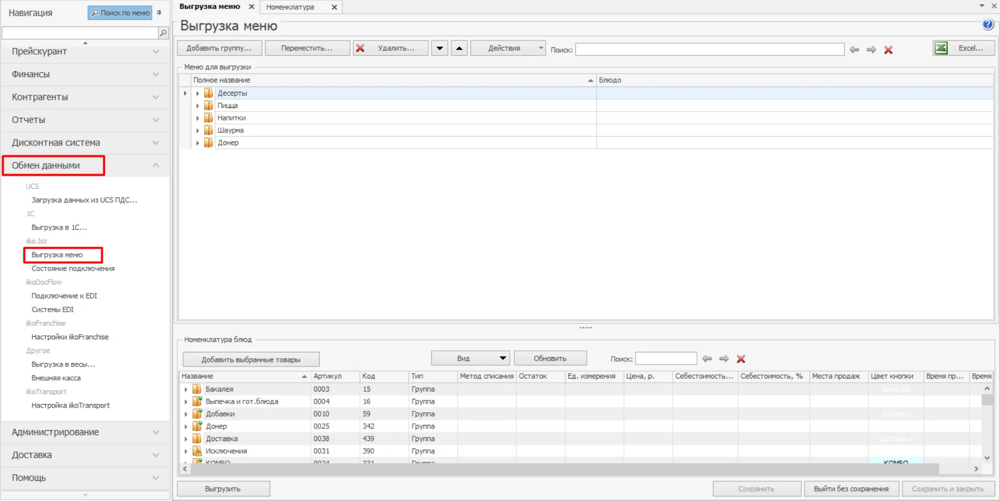
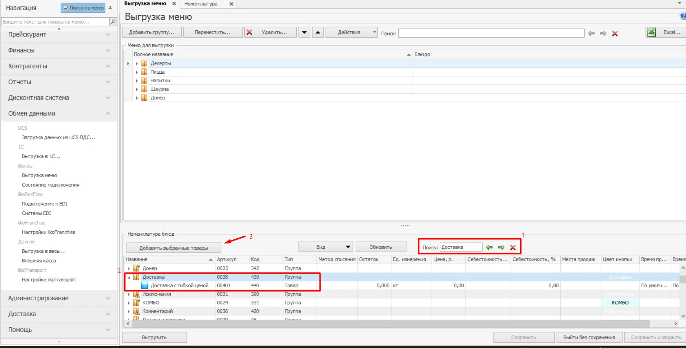
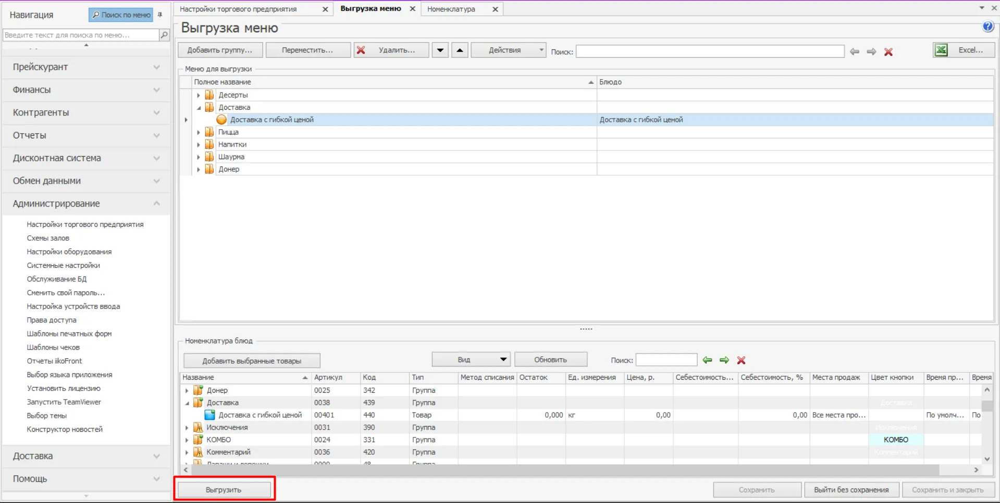

### Инструкция

1. Далее зайти в раздел **“Обмен данными”** — **“Выгрузка меню”**.

2. После этого в нижнем поле находите **Услугу**, которую только что создали (можно по поиску ключевого слова). Нажимаете на группу, далее кнопку **Добавить выбранные товары**

3. Услуга добавится в верхнее поле. Нужно удостовериться что оно точно добавилось, а уже после нажимать кнопку **Сохранить** и далее нажать кнопку **Выгрузить**.

4. Потребуется некоторое время, чтобы созданная услуга выгрузилась. Обычно не более 30 минут. По завершению этого этапа напишите в чат менеджеру TG Order.