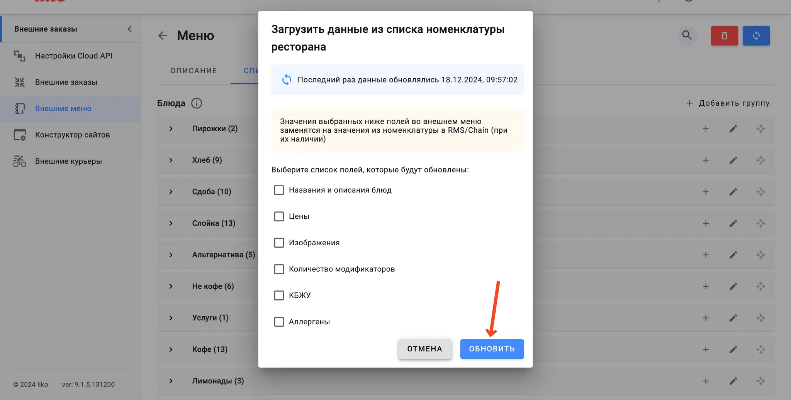

### Инструкция

1. Переходите в настройки **iikoWeb**. Это можно сделать из **iikoOffice**, раздел **Обмен данными** → **Настройка iikoTransport**

2. Выбираем раздел “Внешнее меню”

3. Выбираем меню, которое ранее готовили для доставки

4. Создаем категорию **Доставка**
5. Добавляем услугу **“Доставка со свободной ценой”** в созданную категорию

6. Нажимаем **Обновить**

7. Потребуется некоторое время, чтобы созданная услуга выгрузилась. Обычно не более 30 минут. По завершению этого этапа напишите в чат менеджеру TG Order.