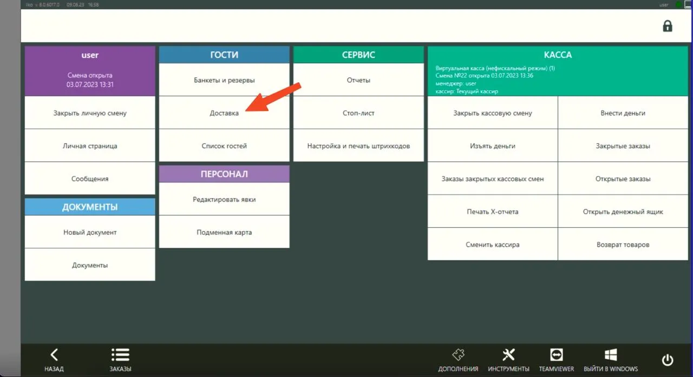

### 1. **Типы оплаты**

Все типы оплаты должны быть доступны для использования **вовне**. Инструкция: [Настройка типов оплат](Настройка_типов_оплат)

### 2. Типы заказов

**Создать тип для заказов на Доставку**
1. Зайдите в раздел **«Розничные продажи»** → **«Типы заказов»**
2. Нажмите **«Добавить…»** — откроется новое окно
3. Введите наименование **«Доставка Курьер Стартер»**
4. В строке **«Режим обслуживания»** из выпадающего списка выберите **«Доставка курьером»**
5. Нажмите **«Сохранить»**
    
**Создать тип для заказов на Самовывоз**
1. Зайдите в раздел **«Розничные продажи»** → **«Типы заказов»**
2. Нажмите **«Добавить…»** — откроется новое окно
3. Введите наименование **«Самовывоз Стартер»**
4. В строке **«Режим обслуживания»** из выпадающего списка выберите **«Доставка самовывоз»**→ **Сохранить**

**Создать тип для заказов В зале (в ресторане)**
1. Зайдите в раздел **«Розничные продажи»** → **«Типы заказов»**
2. Нажмите **«Добавить…»** — откроется новое окно
3. Введите наименование **«Заказ в зале Стартер»**
4. В строке **«Режим обслуживания»** из выпадающего списка выберите **«Доставка самовывоз»**→ **Сохранить**

### 3. Создать услугу “Доставка со свободной ценой” и добавить в выгрузку меню

1. Создать услугу с названием “Доставка со свободной ценой” 
2. В прейскуранте поставить галочку “Свободная цена”. 
3. Добавить созданный товар в выгрузку меню. 

Подробная инструкция: [Добавление доставки со свободной ценой](./Добавление_доставки_iiko)

### 4. Убедиться, что в iikoFront отображается раздел Доставка

Чтобы появился раздел **Доставка** на терминалах приема заказа iiko Front:

1. Нужна лицензия iikoDelivery
2. Нужны права у пользователя на работу с доставкой, под учетной записью которой вы зашли на iikoFront

