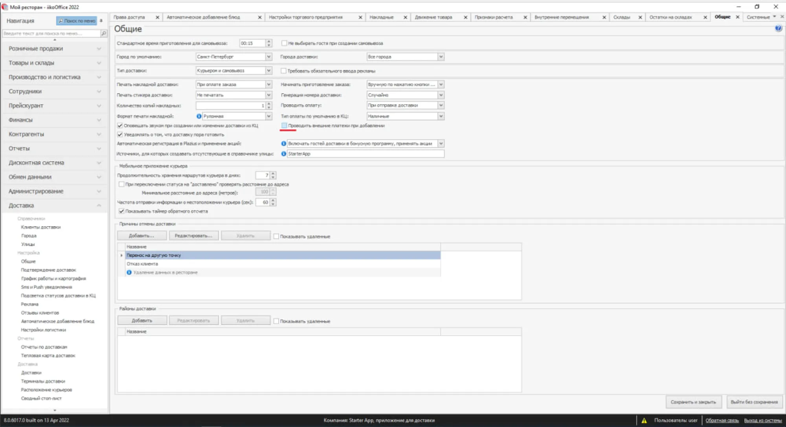
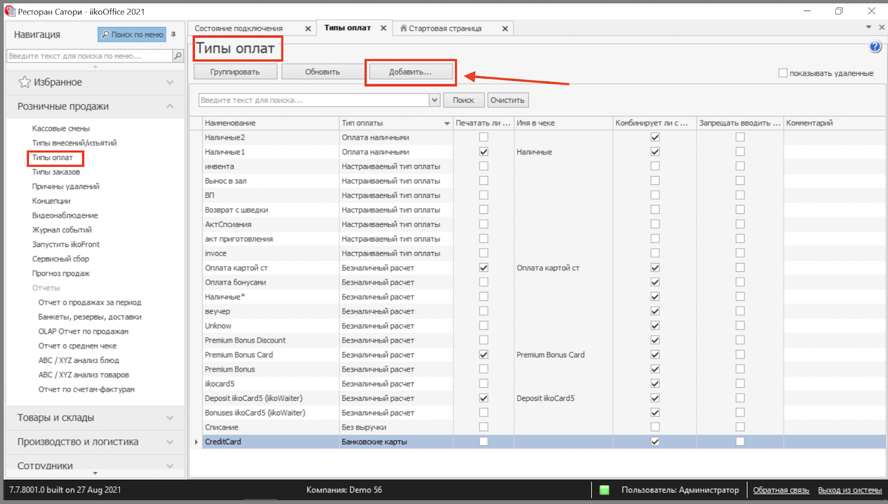
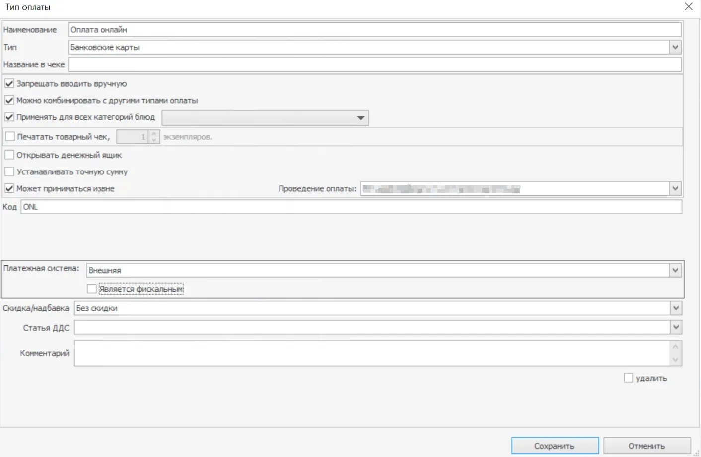
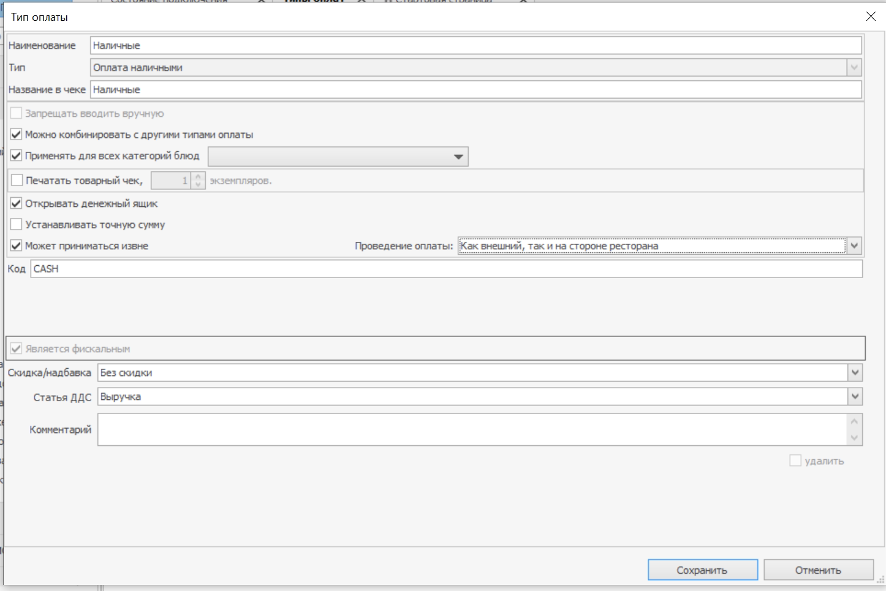
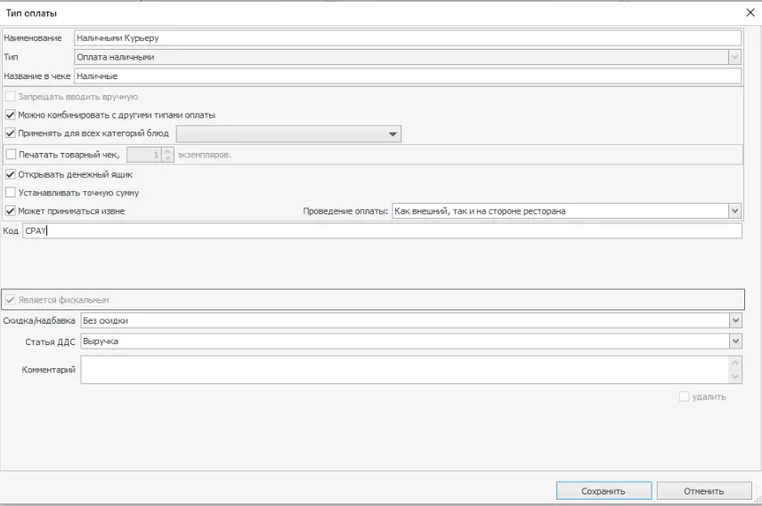

Всю настройку необходимо производить в программе **iikoOffice**

Для начала следует сделать настройку “Проводить внешние платежи при добавлении” Это нужно, чтобы заказы, оплаченные по карте онлайн, сразу приходили в систему как **“Оплачен”**. Для этого перейдите в Раздел **Доставка** — **Общее**.

После этого перейдите в пункт меню 
**“Розничные продажи”** -> **“Типы оплат”** и нажмите на кнопку **“Добавить”**

## 1. Настройка типа оплаты онлайн (картой)

В появившемся окне создания нового типа оплат, сделайте следующие настройки: 
1. Наименование “Оплата онлайн TG Order”. 
2. Укажите тип “Банковские карты”

Установите галочки в следующих местах: 
1. “Запрещать вводить вручную” — на ваше усмотрение, для автономности использования можно не ставить чекбокс. 
2. “Можно комбинировать с другими типами оплат” 
3. “Применять для всех категорий блюд” 
4. “Может приниматься извне”

Дополнительно сделайте следующие настройки:
1. Проведение оплаты поставьте “Только внешний”
2. В поле код напишите **ONL**

#### !Внимание! 

Если у вас подключен эквайринг от TG Order, то заказы будут фискализировать не на вашей стороне. Вам НЕ нужно их фискализировать. 

Если фискализация данного типа оплаты будет на стороне ресторана, то установите настройку “Является фискальным” и напишите в поле “Название в чеке” “Оплата онлайн”. Убедитесь в правильности настроек и нажмите кнопку “Сохранить”. 

Если вы не знаете, на чьей стороне фискализация, уточните это у менеджера TG Order в чате

## 2. Настройка типа оплаты наличными

В появившемся окне создания нового типа оплат, сделайте следующие настройки:
1. Наименование “Оплата наличными TG Order”. 
2. Укажите тип “Наличные”

Установите галочки в следующих местах: 
1. “Можно комбинировать с другими типами оплат” 
2. “Применять для всех категорий блюд” 
3. ”Открывать денежный ящик” 
4. “Может приниматься извне”

Дополнительно сделайте следующие настройки:
1. Проведение оплаты “Как внешний, так и на стороне ресторана”
2. В поле код напишите **CASH**

## 3. Настройка типа оплаты курьеру наличными/картой

В появившемся окне создания нового типа оплат, сделайте следующие настройки:
1. Наименование “Курьеру нал/картой TG Order” 
2. Укажите тип “Наличные”

Установите галочки в следующих местах: 
1. “Можно комбинировать с другими типами оплат” 
2. “Применять для всех категорий блюд” 
3. ”Открывать денежный ящик” 
4. “Может приниматься извне”

Дополнительно сделайте следующие настройки:
1. Проведение оплаты “Как внешний, так и на стороне ресторана”
2. В поле код напишите **CPAY**

#### !Внимание! 
После сохранения типов оплат, убедитесь, что они появились в списке!
 