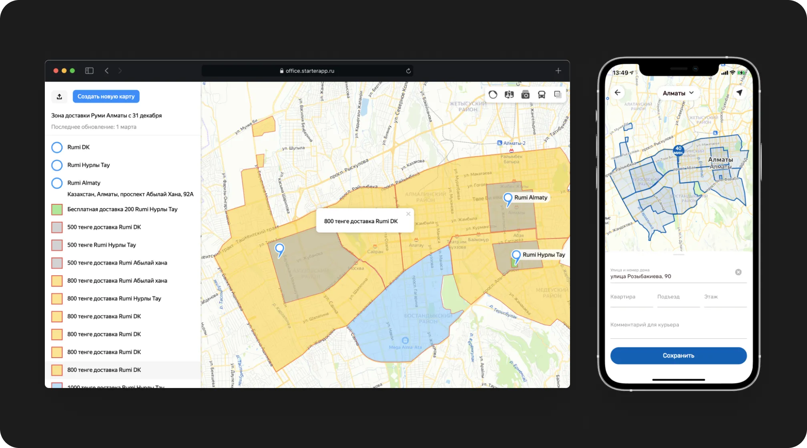

🥝 Telegram Bot и миниприложение

Мини-приложение в Telegram – это меню вашего ресторана с возможностью оформить заказ доставки или с собой. Ещё это личный кабинет пользователя с историей заказов, адресами доставки и картами оплаты.

---

🔗 Интеграции: POS, платежи, доставка

TG Order интегрирован с POS: меню и стоп-листы синхронизированы, а заказы попадают сразу на кухню. Подключены сервисы приёма платежей. Дополнительная регистрация пользователю не нужна – он заказывает напрямую из Telegram мини-приложения.

---

🎛 Управление доставкой

Меняйте условия доставки и режим работы в реальном времени, редактируйте описания и характеристики блюд, управляйте категориями меню.
